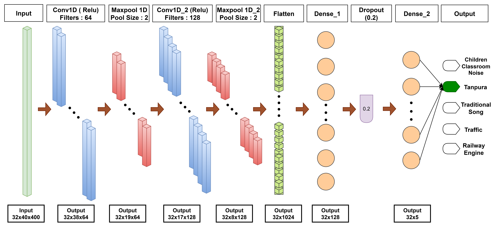

# South-Asian-Sounds_Audio-Classification

This repository contains the code for the research paper **"South Asian Sounds: Audio Classification,"** published at the 4th International Conference on Computer, Communication, Control & Information Technology (C3IT) in 2024.

The project focuses on classifying diverse South Asian urban and cultural sounds by combining **Mel-Frequency Cepstral Coefficients (MFCCs)** with a custom **1D Convolutional Neural Network (1D-CNN)**.

---

## 🏗️ Model Architecture

Below is the architecture of the proposed SAS-CNN model used in this study.


---
---
## ✨ Key Highlights

-   Audio recordings are preprocessed and segmented into standardized 4-second clips.
-   Features are extracted using **MFCCs** to capture the unique spectral characteristics of each sound.
-   Classification is performed using a custom **1D-CNN (SAS-CNN)** and compared against baseline models like ResNet50V2.
-   The model was evaluated on two key datasets: the newly introduced **SAS-KIIT dataset** and the benchmark **UrbanSound8K dataset**.
-   High classification accuracy was achieved through 10-fold cross-validation:
    -   **99.78%** on the SAS-KIIT dataset.
    -   **94.26%** on the UrbanSound8K dataset.

---

## 🏆 Contribution

This research makes the following contributions:
-   Proposes a robust and effective pipeline for classifying **South Asian urban sounds**.
-   Introduces the **SAS-KIIT dataset**, a new public resource for the research community.
-   Demonstrates that combining MFCC features with a 1D-CNN is a highly effective approach for multi-class sound recognition.

---

## 🔗 Links

-   **Published Paper (IEEE Xplore):** [`https://ieeexplore.ieee.org/document/10829485`](https://ieeexplore.ieee.org/document/10829485)
-   **SAS-KIIT Dataset:** [`https://sas-kiit.netlify.app/`](https://sas-kiit.netlify.app/)

---

## 💻 Code Overview

This repository contains the Python scripts for the complete pipeline:
-   Audio preprocessing and feature extraction (MFCCs).
-   Implementation of the 1D-CNN (SAS-CNN) model.
-   Scripts for model training, evaluation, and inference.


---


## 📄 Citation

If you find this work useful in your research, please cite the paper.

### BibTeX

```bibtex
@INPROCEEDINGS{10829485,
  author={Chatterjee, Rajdeep and Bishwas, Pappu and Chakrabarty, Sudip and Bandyopadhyay, Tathagata},
  booktitle={2024 4th International Conference on Computer, Communication, Control & Information Technology (C3IT)}, 
  title={South Asian Sounds: Audio Classification}, 
  year={2024},
  volume={},
  number={},
  pages={1-6},
  keywords={Translation; Pollution; Smart cities; Biological system modeling; Surveillance; Noise; Urban planning; Feature extraction; Rail transportation; Mel frequency cepstral coefficient; Audio classification; CNN; MFCC; Sound recognition},
  doi={10.1109/C3IT60531.2024.10829485}
}
